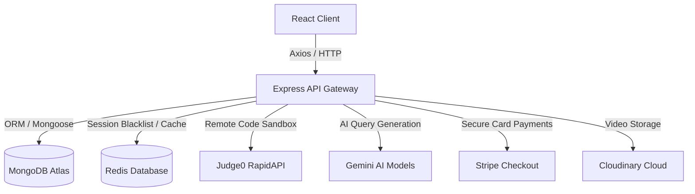

# ⚔️ CodeArena — Collaborative DSA Learning & Assessment Platform

[](https://vite.dev/)
[](https://react.dev/)
[](https://redux-toolkit.js.org/)
[](https://expressjs.com/)
[](https://www.mongodb.com/)
[](https://redis.io/)
[](https://stripe.com/)
[](https://ai.google.dev/)

CodeArena is a state-of-the-art, feature-rich coding playground and assessment platform modeled after LeetCode. It allows users to write code in multiple programming languages, run test cases in a sandbox, track streak milestones, unlock premium features via Stripe, and get personalized hints from an AI tutor.

---

## 🚀 Core Features

### 👨‍💻 Sandboxed Code Execution
- Integrated **Monaco Editor** (the engine behind VS Code) with auto-completion and syntax highlighting.
- Remote compiler sandbox running via the **Judge0 API** supporting **C++**, **Java**, and **JavaScript (Node.js)**.
- Real-time batch-testing of custom and hidden test cases, tracking runtime speed, memory limits, and compilation errors.

### 🤖 AI Doubt Solver (Gemini 2.5 Flash)
- An interactive **AI coding assistant** that acts as an expert DSA tutor.
- Context-aware chatbot that reviews the user's current code, points out logical edge cases, suggests algorithmic trade-offs, and provides step-by-step hints without spoiling the solution.
- Gated rate limiting: Free users get up to 5 AI hints per problem, while Premium users get unlimited doubts solved.

### 💳 Stripe & Monetization (PRO Membership)
- Integrated **Stripe Checkout Sessions** allowing users to upgrade to **CodeArena PRO** (₹499 INR).
- Direct backend webhook signature verification and post-payment MongoDB user upgrade flow.
- Unlocks video editorials, unlimited AI assistance queries, and premium profiling badges.

### 📹 Video Solutions & Cloudinary Asset Delivery
- Admins can record and upload video solution walk-throughs for specific problems directly from the dashboard.
- Uses **Cloudinary's signed upload request signatures** to securely upload large video streams directly from the frontend to Cloudinary.
- Backend parses metadata to generate dynamic image thumbnails, offsets, and durations.

### 🏆 Gamification & Leaderboard
- Tracks **Solved Streaks** (daily count, current streak, max streak milestone logs).
- Automatically resets or increments user streaks upon consecutive daily DSA solves.
- Real-time **Global Leaderboard** sorted by problems solved and daily active streak.

---

## 🛠️ Architecture & Tech Stack



- **Frontend**: React (Vite), Redux Toolkit, TailwindCSS, DaisyUI, Monaco Editor React.
- **Backend**: Node.js, Express.js (REST API, JWT Authentication, Custom Auth/Admin Middlewares).
- **Databases**: MongoDB (Atlas), Redis (Token Blacklist Cache).
- **APIs & Services**: Judge0, Cloudinary SDK, Google GenAI SDK, Stripe Node API, Nodemailer SMTP.

---

## 📂 Project Organization

```
├── Backend/
│   ├── src/
│   │   ├── config/       # MongoDB and Redis Client setup
│   │   ├── controllers/  # Route handlers (Auth, Submissions, AI, Video, Stripe)
│   │   ├── middleware/   # Token authentication & admin validation
│   │   ├── models/       # Mongoose schemas (User, Problem, Submission, Video)
│   │   ├── routers/      # Express REST router maps
│   │   └── utils/        # RapidAPI helper utils, SMTP Mailer config, Validator
│   ├── package.json
│   └── .env
└── Frontend/
    ├── src/
    │   ├── components/   # Shared layouts (Navbar, ChatAI, Editorials, Admin panel)
    │   ├── pages/        # Router views (Homepage, Playground, Profile, Leaderboard, Login)
    │   ├── store/        # Redux Toolkit global store state definitions
    │   ├── utils/        # Axios API clients
    │   ├── App.jsx       # Route maps (including custom 404 handler)
    │   └── main.jsx      # Entry mount point
    ├── tailwind.config.js
    └── package.json
```

---

## ⚙️ Environment Configuration

To run locally, you need to set up environment variables for both the backend and frontend.

### 1. Backend Config (`/Backend/.env`)
Create a `.env` file in the `Backend` directory:
```env
PORT=3000
DB_CONNECT_STRING="your_mongodb_connection_string"
JWT_KEY="your_secure_jwt_secret"
REDIS_PASS="your_redis_db_password"
GEMINI_KEY="your_google_gemini_api_key"
CLOUDINARY_CLOUD_NAME="your_cloudinary_cloud_name"
CLOUDINARY_API_KEY="your_cloudinary_api_key"
CLOUDINARY_API_SECRET="your_cloudinary_secret"
SMTP_HOST=smtp.gmail.com
SMTP_PORT=587
SMTP_USER="your_gmail_id"
SMTP_PASS="your_gmail_app_password"
GOOGLE_CLIENT_ID="your_google_oauth_client_id"
GOOGLE_CLIENT_SECRET="your_google_oauth_secret"
GOOGLE_REDIRECT_URI="http://localhost:3000/user/auth/google/callback"
CLIENT_URL="http://localhost:5173"
STRIPE_SECRET_KEY="your_stripe_secret_key"
RAPIDAPI_KEY="your_rapidapi_judge0_key"
```

### 2. Frontend Config (`/Frontend/.env`)
Create a `.env` file in the `Frontend` directory:
```env
VITE_API_BASE_URL="http://localhost:3000"
```

---

## 📦 Getting Started

### Prerequisites
- Node.js installed locally.
- MongoDB Atlas cluster set up.
- Redis cloud instance running.

### Setup Instructions

1. **Clone the repository**:
   ```bash
   git clone https://github.com/your-username/codearena.git
   cd codearena
   ```

2. **Start Backend Server**:
   ```bash
   cd Backend
   npm install
   npm run dev
   ```

3. **Start Frontend Dev App**:
   ```bash
   cd ../Frontend
   npm install
   npm run dev
   ```

4. **Navigate to app**:
   Open [http://localhost:5173](http://localhost:5173) in your browser.
